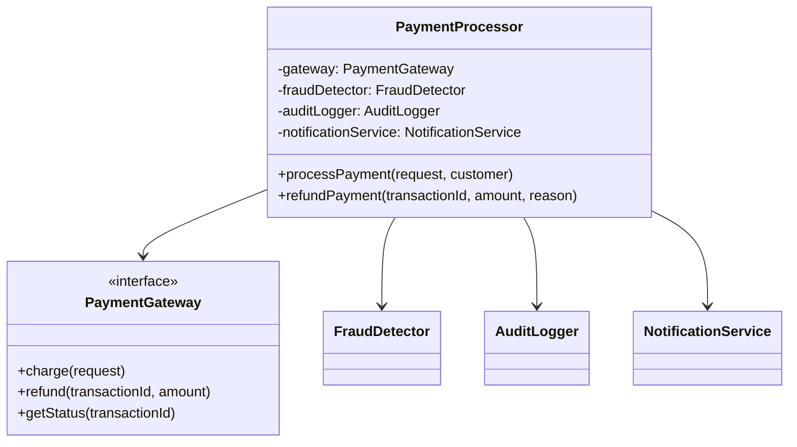
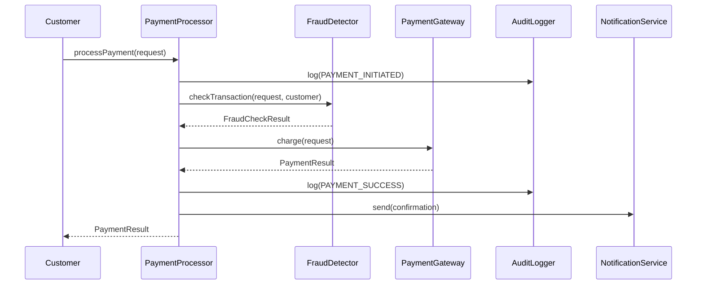

# Exercise 03: Agent Mode, Documentation & Mermaid Diagrams

## Overview

This exercise teaches you to use **Cursor's Agent mode** to generate comprehensive documentation including Mermaid diagrams. The Payment Service is a multi-module TypeScript project that intentionally lacks documentation.

## Learning Objectives

- Use Agent mode to analyze and document complex codebases
- Generate README and API documentation
- Create architecture diagrams using Mermaid
- Index documentation for enhanced AI context
- Understand payment processing flow through generated visualizations

## The Payment Service

This is a simulated payment processing service with the following modules:

```
src/
├── core/
│   └── PaymentProcessor.ts    # Main orchestrator
├── gateways/
│   ├── PaymentGateway.ts      # Interface
│   ├── StripeGateway.ts       # Stripe implementation
│   └── PayPalGateway.ts       # PayPal implementation
├── security/
│   └── FraudDetector.ts       # Fraud detection logic
├── audit/
│   └── AuditLogger.ts         # Audit trail logging
├── notifications/
│   └── NotificationService.ts # Multi-channel notifications
├── types.ts                   # Type definitions
└── index.ts                   # Public exports
```

## Setup

```bash
cd examples/03-agent-docs-and-mermaid
npm install
```

## Run Tests

```bash
npm test
```

## Build

```bash
npm run build
```

## Exercise: Generate Documentation

### Step 1: Analyze the Codebase

Use Agent mode to understand the system:

```
Analyze the payment service codebase. Identify:
1. Main components and their responsibilities
2. Data flow through the system
3. External dependencies and interfaces
4. Error handling patterns
```

### Step 2: Generate README Documentation

```
Generate a comprehensive README.md for this payment service. Include:
- Overview and purpose
- Installation and setup
- Quick start example
- Configuration options
- API overview
Write the output to docs/README.md
```

### Step 3: Generate Architecture Documentation with Mermaid

```
Create an ARCHITECTURE.md file with Mermaid diagrams showing:
1. A class diagram of all major classes and their relationships
2. A sequence diagram of the payment processing flow
3. A flowchart of the fraud detection logic
Write the output to docs/ARCHITECTURE.md
```

**Expected Mermaid diagrams:**

1. **Class Diagram** - Shows relationships between PaymentProcessor, Gateways, FraudDetector, AuditLogger, NotificationService

2. **Sequence Diagram** - Shows the flow: Customer → PaymentProcessor → FraudDetector → Gateway → AuditLogger → NotificationService

3. **Flowchart** - Shows fraud detection decision tree

### Step 4: Generate API Reference

```
Generate an API.md file documenting all public classes and methods. For each:
- Description
- Parameters with types
- Return values
- Example usage
Write the output to docs/API.md
```

### Step 5: Generate Security Documentation

```
Analyze the FraudDetector and create SECURITY.md documenting:
- Fraud detection algorithms
- Risk scoring methodology
- Velocity checks
- Configuration options
- Best practices for production
Write the output to docs/SECURITY.md
```

## Indexing Documentation

After generating docs, configure Cursor to index them:

1. Open Cursor Settings
2. Navigate to Features → Codebase Indexing
3. Ensure the `docs/` folder is included
4. Wait for indexing to complete

### Verify Indexing Worked

Test with this prompt:
```
Based on the indexed documentation, explain how the fraud detection system works in this codebase.
```

If indexing worked, Cursor should reference your generated docs in its response.

## Expected Outputs

After completing this exercise, `docs/` should contain:

- [ ] `README.md` - Project overview (500+ words)
- [ ] `ARCHITECTURE.md` - System design with 3+ Mermaid diagrams
- [ ] `API.md` - Complete API reference
- [ ] `SECURITY.md` - Security documentation

## Mermaid Diagram Examples

Here are examples of the types of diagrams you should generate:

### Class Diagram (expected output)


### Sequence Diagram (expected output)


## Verification Checklist

- [ ] All 4 documentation files exist in `docs/`
- [ ] Each file contains meaningful, accurate content
- [ ] Mermaid diagrams render correctly (test in VS Code preview)
- [ ] Documentation matches actual code structure
- [ ] Tests still pass after any code analysis

## Success Criteria

You've completed this exercise when:
1. All documentation files are generated
2. Mermaid diagrams accurately represent the codebase
3. Documentation is indexed and searchable in Cursor
4. You can answer questions about the codebase using indexed context
