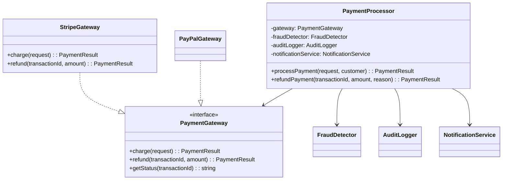
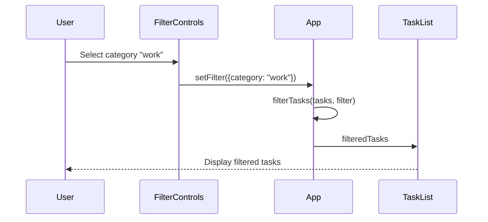

# Cursor Team Training: Hands-On Workshop

A comprehensive, hands-on training program for software teams adopting Cursor as their AI-powered development environment.

---

## Training Overview

### Audience
- Software developers with 1+ years of coding experience
- Teams transitioning to or adopting Cursor
- Developers familiar with VS Code or similar editors

### Prerequisites
- Cursor installed (download from [cursor.com](https://cursor.com))
- Node.js 18+ installed
- Git installed and configured
- Basic TypeScript/JavaScript knowledge
- Access to this training repository

### Duration
- **Full Training:** 4-6 hours (all modules)
- **Quick Start:** 2 hours (Modules 1-3)
- **Advanced Topics:** 2 hours (Modules 4-7)

### Learning Outcomes

By the end of this training, you will be able to:

1. Use Cursor's core features: Chat, Tab completion, and Composer
2. Navigate between Ask, Plan, Agent, and Debug modes effectively
3. Use the Browser Agent for accessibility audits and UI debugging
4. Configure and use Rules, Commands, and Skills for team standards
5. Generate documentation including Mermaid diagrams
6. Set up and use MCP servers to extend Cursor's capabilities
7. Index documentation for enhanced AI context
8. Apply best practices for AI-assisted development
9. Know when to use Cloud Agents for background tasks

---

## Table of Contents

1. [Module 1: Getting Started with Cursor](#module-1-getting-started-with-cursor)
2. [Module 2: Tabs and Tab Completion](#module-2-tabs-and-tab-completion)
3. [Module 3: Operating Modes](#module-3-operating-modes)
4. [Module 4: Browser Agent](#module-4-browser-agent)
5. [Module 5: Documentation and Indexing](#module-5-documentation-and-indexing)
6. [Module 6: Rules, Commands, and Skills](#module-6-rules-commands-and-skills)
7. [Module 7: Model Context Protocol (MCP)](#module-7-model-context-protocol-mcp)
8. [Module 8: Cloud Agents](#module-8-cloud-agents)
9. [Capstone Exercise](#capstone-exercise)
10. [Reference and Resources](#reference-and-resources)

---

## Module 1: Getting Started with Cursor

### What You Will Do
- Install and configure Cursor
- Understand the core interface
- Learn fundamental concepts
- Run your first AI-assisted edit

### Core Concepts

Cursor is an AI-powered code editor built on VS Code. Key concepts include:

| Concept | Description |
|---------|-------------|
| **Chat** | Conversational interface for asking questions and requesting changes |
| **Composer** | Multi-file editing mode for larger changes |
| **Tab Completion** | Inline code suggestions as you type |
| **Modes** | Different interaction styles: Ask, Plan, Agent, Debug |
| **Context** | Files, documentation, and information the AI can access |
| **Rules** | Instructions that guide AI behavior |

For detailed explanations, see:
- [Cursor Quickstart Guide](https://cursor.com/docs/get-started/quickstart)
- [Core Concepts](https://cursor.com/docs/get-started/concepts)

### Exercise 1.1: First Interaction

1. Open this repository in Cursor:
   ```bash
   cd cursor-training
   cursor .
   ```

2. Open the Chat panel (Cmd/Ctrl + L)

3. Try this prompt:
   ```
   What files are in the examples/ directory? Summarize the purpose of each example project.
   ```

4. **Expected Output:** A summary of the three example projects and their learning objectives.

5. **Verification:** Check that Cursor correctly identifies:
   - `01-tabs-refactor` - TypeScript refactoring exercise
   - `02-debug-and-browser-agent` - React app with bugs and accessibility issues
   - `03-agent-docs-and-mermaid` - Documentation generation exercise

### Exercise 1.2: Understanding Context

1. Open `examples/01-tabs-refactor/src/userService.ts`

2. Select the `validateUserName` function

3. With the function selected, open Chat (Cmd/Ctrl + L) and ask:
   ```
   Explain this function and identify any patterns that could be abstracted.
   ```

4. **Expected Output:** Cursor explains the function and notes that the validation pattern (check empty, check length, check format) is repeated in similar functions.

### Common Failure Modes and Recovery

| Issue | Cause | Recovery |
|-------|-------|----------|
| Chat panel doesn't respond | Connection issue | Check internet, restart Cursor |
| AI doesn't see your file | File not saved | Save file (Cmd/Ctrl + S) |
| Wrong context | Wrong files in context | Clear chat, add correct files with @file |
| Response cut off | Token limit | Ask "continue" or break into smaller requests |

### Knowledge Check

1. What keyboard shortcut opens the Chat panel?
2. How do you add a specific file to the AI's context?
3. What's the difference between Chat and Composer?
4. How do you select code to include in your prompt?
5. Where can you see what context the AI is using?

<details>
<summary>Answers</summary>

1. Cmd/Ctrl + L
2. Use @file and type the filename
3. Chat is for conversation; Composer is for multi-file edits
4. Select the code, then press Cmd/Ctrl + L to include it
5. Look at the "Context" section in the Chat panel

</details>

---

## Module 2: Tabs and Tab Completion

### What You Will Do
- Master Cursor's intelligent tab completion
- Use tab completion for refactoring
- Accept, reject, and modify suggestions
- Configure tab completion settings

### Tab Completion Overview

Tab completion provides real-time code suggestions as you type. Unlike traditional autocomplete, Cursor predicts entire lines or blocks based on:
- Surrounding code context
- Your coding patterns
- The current file's purpose
- Related files in the project

### Key Controls

| Action | Shortcut |
|--------|----------|
| Accept suggestion | Tab |
| Accept word | Ctrl + Right Arrow |
| Reject suggestion | Escape |
| Trigger manually | Ctrl + Space |
| Cycle suggestions | Alt + [ / Alt + ] |

### Exercise 2.1: Tab Completion for Refactoring

1. Open `examples/01-tabs-refactor/` in Cursor

2. Install dependencies:
   ```bash
   cd examples/01-tabs-refactor
   npm install
   ```

3. Run tests to establish baseline:
   ```bash
   npm test
   ```

4. Open `src/userService.ts`

5. Scroll to line 68 (after `validateUserRole` function)

6. Start typing a new generic validation function:
   ```typescript
   interface ValidationRule {
   ```

7. **Watch for tab suggestions.** Cursor should suggest completing the interface with properties like `required`, `minLength`, `maxLength`, `pattern`.

8. Accept suggestions with Tab, modify as needed.

9. Continue typing:
   ```typescript
   function createValidator(rules: ValidationRule) {
   ```

10. Let Cursor suggest the implementation. It should propose a function that:
    - Checks if value is required
    - Validates min/max length
    - Tests against a regex pattern

### Exercise 2.2: Refactor Using Suggestions

**Goal:** Refactor the three validation functions to use your new generic validator.

1. After the `createValidator` function, type:
   ```typescript
   export const validateName = createValidator({
   ```

2. Cursor should suggest the configuration based on the existing `validateUserName` function.

3. Repeat for `validateEmail` and `validateRole`.

4. Run tests to verify refactoring:
   ```bash
   npm test
   ```

**Expected Result:** All tests pass with your refactored code.

### Verification Checklist

- [ ] Tab suggestions appear as you type
- [ ] You can accept/reject suggestions with Tab/Escape
- [ ] Generic validator function is created
- [ ] Original validation functions work through the new abstraction
- [ ] All tests pass

### Common Failure Modes and Recovery

| Issue | Cause | Recovery |
|-------|-------|----------|
| No suggestions appear | Tab completion disabled | Check Settings → Features → Tab Completion |
| Wrong suggestions | Limited context | Open related files, add comments explaining intent |
| Suggestions too slow | Large project | Enable "Fast" mode in settings |
| Accepts wrong code | Hasty Tab press | Undo (Cmd/Ctrl + Z), be more selective |

### Knowledge Check

1. What triggers tab completion in Cursor?
2. How do you accept only part of a suggestion?
3. What context does Cursor use for suggestions?
4. How can you improve suggestion quality?
5. When should you prefer explicit prompts over tab completion?

<details>
<summary>Answers</summary>

1. Typing - suggestions appear automatically as you code
2. Ctrl + Right Arrow accepts word by word
3. Current file, open files, codebase patterns, and your coding style
4. Add comments, open related files, use descriptive names
5. For complex changes, multi-file edits, or when you need to explain "why"

</details>

---

## Module 3: Operating Modes

### What You Will Do
- Understand the four operating modes
- Practice switching between modes
- Learn when to use each mode
- Complete exercises in each mode

### The Four Modes

| Mode | Purpose | Best For |
|------|---------|----------|
| **Ask** | Information and explanations | Learning, understanding code, quick questions |
| **Plan** | Strategy and task breakdown | Complex changes, architecture decisions |
| **Agent** | Autonomous code changes | Multi-file edits, refactoring, feature implementation |
| **Debug** | Runtime issue diagnosis | Fixing bugs, understanding errors |

For detailed documentation, see [Operating Modes](https://cursor.com/docs/agent/modes).

### Exercise 3.1: Ask Mode

**Scenario:** You need to understand the payment processing flow.

1. Open `examples/03-agent-docs-and-mermaid/src/core/PaymentProcessor.ts`

2. Switch to Ask mode (look for mode selector in Chat panel)

3. Use this prompt:
   ```
   Explain how the processPayment method works. Walk through each step and explain what could go wrong at each stage.
   ```

4. **Expected Output:** Step-by-step explanation of:
   - Audit logging the attempt
   - Fraud check
   - Gateway charge
   - Result logging
   - Notification sending

5. **Verification:** Cursor explains without modifying any code.

### Exercise 3.2: Plan Mode

**Scenario:** You need to add a new payment gateway.

1. Stay in `examples/03-agent-docs-and-mermaid/`

2. Switch to Plan mode

3. Use this prompt:
   ```
   I need to add support for a new payment gateway called "SquareGateway". Create a plan for implementing this, including:
   - Files to create or modify
   - Implementation steps
   - Testing strategy
   - Potential risks
   ```

4. **Expected Output:** A structured plan with:
   - New file: `src/gateways/SquareGateway.ts`
   - Steps to implement the PaymentGateway interface
   - Test cases to add
   - Risk considerations (API differences, error handling)

5. **Verification:** Plan mode provides a roadmap without making changes.

### Exercise 3.3: Agent Mode

**Scenario:** Execute the plan from Exercise 3.2.

1. Switch to Agent mode

2. Use this prompt:
   ```
   Implement the SquareGateway based on the plan. Create the new file, implement the PaymentGateway interface, and add basic tests.
   ```

3. **Expected Output:** Cursor autonomously:
   - Creates `src/gateways/SquareGateway.ts`
   - Implements all interface methods
   - Creates or updates test files
   - Shows you changes before applying

4. **Verification:**
   ```bash
   npm test
   ```
   New tests should pass.

### Exercise 3.4: Debug Mode

**Scenario:** Fix the delete bug in the React app.

1. Open `examples/02-debug-and-browser-agent/`

2. Install and run:
   ```bash
   cd examples/02-debug-and-browser-agent
   npm install
   npm run dev
   ```

3. Open http://localhost:3000 and try to delete a task. Notice the bug!

4. In Cursor, switch to Debug mode

5. Use this prompt:
   ```
   When I click delete on a task, the wrong task gets deleted. The bug is in App.tsx. Help me find and fix it.
   ```

6. **Expected Output:** Cursor:
   - Identifies the `deleteTask` function
   - Points out the `wrongIndex = index + 1` bug
   - Suggests the fix (use `index` directly)
   - Explains why the bug exists

7. **Apply the fix and verify** in the browser.

### Mode Selection Guide

```
┌─────────────────────────────────────────────────┐
│           "What do I want to do?"               │
└─────────────────────────────────────────────────┘
                      │
         ┌────────────┼────────────┐
         ▼            ▼            ▼
   ┌──────────┐ ┌──────────┐ ┌──────────┐
   │Learn/    │ │Plan/     │ │Fix/      │
   │Understand│ │Strategize│ │Implement │
   └────┬─────┘ └────┬─────┘ └────┬─────┘
        ▼            ▼            ▼
   ┌──────────┐ ┌──────────┐ ┌──────────────────┐
   │ ASK MODE │ │PLAN MODE │ │Is it a bug?      │
   └──────────┘ └──────────┘ └────────┬─────────┘
                                  Yes │    No
                              ┌───────┴───────┐
                              ▼               ▼
                        ┌──────────┐   ┌──────────┐
                        │DEBUG MODE│   │AGENT MODE│
                        └──────────┘   └──────────┘
```

### Knowledge Check

1. Which mode would you use to understand how a function works?
2. Which mode would you use before starting a major refactor?
3. Which mode creates and modifies files autonomously?
4. Which mode is best for tracing runtime errors?
5. Can you switch modes mid-conversation?

<details>
<summary>Answers</summary>

1. Ask mode - for learning and explanations
2. Plan mode - for strategy and task breakdown
3. Agent mode - for autonomous code changes
4. Debug mode - for runtime issue diagnosis
5. Yes, you can switch modes at any time

</details>

---

## Module 4: Browser Agent

### What You Will Do
- Use the Browser Agent for accessibility audits
- Identify and fix UI issues
- Test responsive behavior
- Perform visual debugging

### Browser Agent Overview

The Browser Agent allows Cursor to interact with running web applications. It can:
- Navigate and interact with pages
- Perform accessibility audits
- Identify visual/layout issues
- Test responsive behavior
- Capture screenshots for analysis

For detailed documentation, see [Browser Integration](https://cursor.com/docs/agent/browser).

### Exercise 4.1: Accessibility Audit

1. Ensure the example app is running:
   ```bash
   cd examples/02-debug-and-browser-agent
   npm run dev
   ```

2. In Cursor, enable Browser Agent (check settings or use the @browser mention)

3. Use this prompt:
   ```
   @browser Navigate to http://localhost:3000 and perform an accessibility audit. Report all WCAG violations found.
   ```

4. **Expected Output:** The Browser Agent should identify:
   - Missing form labels on input and select
   - Low contrast text (subtitle and footer)
   - Incorrect heading hierarchy (h3, h5, h6 instead of h1, h2, h3)
   - Delete buttons without accessible names
   - Color-only priority indicators

### Exercise 4.2: Fix Accessibility Issues

**Prompt to use:**
```
Fix the accessibility issues you found. For each fix:
1. Add proper labels to form elements
2. Fix the heading hierarchy (h1 → h2 → h3)
3. Improve color contrast to meet WCAG AA
4. Add aria-labels to delete buttons
5. Add text to priority badges

Apply all fixes and show me the changes.
```

**Expected Changes:**

- `src/App.tsx`: Change h3 to h1, h5 to h2, h6 to h3
- `src/components/TaskForm.tsx`: Add labels with htmlFor
- `src/components/TaskList.tsx`: Add aria-label to delete buttons, add text to priority badges
- `src/styles.css`: Increase contrast for subtitle and footer text

### Exercise 4.3: Responsive Testing

1. Use this prompt:
   ```
   @browser Check the page at 375px viewport width. Are there any layout issues?
   ```

2. **Expected Output:** Browser Agent should identify:
   - Form elements overflow horizontally
   - Flex container doesn't wrap properly

3. **Fix prompt:**
   ```
   Fix the responsive layout issues at mobile viewport widths. The form should stack vertically on narrow screens.
   ```

4. **Verification:**
   - Open browser DevTools
   - Set viewport to 375px width
   - Confirm form stacks correctly

### Verification Checklist

After fixing all issues:

- [ ] Form inputs have visible labels
- [ ] Heading order is h1 → h2 → h3
- [ ] Color contrast passes WCAG AA (4.5:1)
- [ ] Delete buttons have aria-labels
- [ ] Priority badges show text labels
- [ ] Layout works at 375px width
- [ ] Run `npm run test:a11y` passes

### Common Failure Modes and Recovery

| Issue | Cause | Recovery |
|-------|-------|----------|
| Browser Agent can't connect | App not running | Ensure `npm run dev` is active |
| Timeouts | Page slow to load | Increase timeout, check for errors |
| Missing elements | Wrong URL | Verify URL is correct |
| Inconsistent results | Dynamic content | Wait for page load, use stable selectors |

### Knowledge Check

1. How do you invoke the Browser Agent in Cursor?
2. What types of accessibility issues can the Browser Agent detect?
3. What WCAG contrast ratio is required for normal text?
4. How can you test responsive behavior with the Browser Agent?
5. What's the difference between aria-label and aria-labelledby?

<details>
<summary>Answers</summary>

1. Use @browser in prompts or enable in settings
2. Missing labels, contrast issues, heading hierarchy, missing alt text, etc.
3. 4.5:1 for normal text, 3:1 for large text (WCAG AA)
4. Ask Browser Agent to resize viewport or check at specific widths
5. aria-label provides the label directly; aria-labelledby references another element's ID

</details>

---

## Module 5: Documentation and Indexing

### What You Will Do
- Generate README and API documentation
- Create Mermaid diagrams from code
- Index documentation for AI context
- Verify indexing works correctly

### Documentation Generation

Cursor can analyze your codebase and generate:
- README files with project overview
- API documentation from types and JSDoc
- Architecture diagrams using Mermaid
- Changelog entries

For more on documentation generation, see [Cursor for Documentation](https://cursor.com/for/documentation).

### Mermaid Diagrams

Mermaid is a markdown-based diagramming syntax. Cursor can generate:
- Class diagrams
- Sequence diagrams
- Flowcharts
- Entity relationship diagrams

For Mermaid in Cursor, see [Mermaid Diagrams Cookbook](https://cursor.com/docs/cookbook/mermaid-diagrams).

### Exercise 5.1: Generate README

1. Open `examples/03-agent-docs-and-mermaid/`

2. Use Agent mode with this prompt:
   ```
   Generate a comprehensive README.md for this payment service. Include:
   - Project overview and purpose
   - Installation instructions
   - Quick start code example showing how to process a payment
   - Configuration options
   - Module descriptions
   
   Write the output to docs/README.md
   ```

3. **Expected Output:** A README file in `docs/` with all requested sections.

4. **Verification:** Open `docs/README.md` and confirm it accurately describes the project.

### Exercise 5.2: Generate Architecture Documentation with Mermaid

1. Use this prompt:
   ```
   Create an ARCHITECTURE.md file for the payment service with Mermaid diagrams:

   1. A class diagram showing PaymentProcessor, PaymentGateway, FraudDetector, AuditLogger, and NotificationService with their relationships

   2. A sequence diagram showing the complete payment flow from request to notification

   3. A flowchart showing the fraud detection decision process

   Write to docs/ARCHITECTURE.md
   ```

2. **Expected Output:** Three Mermaid diagrams embedded in markdown.

3. **Verification:** Preview the markdown file - diagrams should render correctly.

**Example of expected class diagram:**


### Exercise 5.3: Index Documentation

1. In Cursor, go to **Settings → Features → Codebase Indexing**

2. Ensure the `docs/` folder is included in indexed paths

3. Wait for indexing to complete (watch the status indicator)

4. **Verify indexing worked** with this test:
   ```
   Based on the indexed documentation, explain how the fraud detection system works. Reference specific documentation files.
   ```

5. **Expected:** Cursor should reference your generated docs in its response.

### Verify Indexing Checklist

- [ ] Indexing status shows "complete" or "up to date"
- [ ] `docs/` folder is in the indexed paths
- [ ] AI responses reference documentation files
- [ ] Search includes documentation results
- [ ] New docs are indexed after generation

### Exercise 5.4: Generate API Reference

```
Generate an API.md documenting all public exports from this payment service. For each class/function:
- Description from JSDoc or inferred from code
- Parameters with types
- Return values
- Example usage

Write to docs/API.md
```

### Common Failure Modes and Recovery

| Issue | Cause | Recovery |
|-------|-------|----------|
| Diagrams don't render | Invalid Mermaid syntax | Ask Cursor to fix syntax errors |
| Indexing stuck | Large codebase | Exclude node_modules, dist |
| Docs not found by AI | Not indexed yet | Wait for indexing, check paths |
| Incomplete docs | Missing JSDoc | Add JSDoc comments first |

### Knowledge Check

1. What Mermaid diagram type shows class relationships?
2. How do you verify that documentation is indexed?
3. What's required for a sequence diagram?
4. Where do you configure indexing settings?
5. How does indexing improve AI responses?

<details>
<summary>Answers</summary>

1. classDiagram
2. Ask about content in docs; AI should reference the files
3. Participants and message arrows between them
4. Settings → Features → Codebase Indexing
5. AI can reference documentation for more accurate, context-aware responses

</details>

---

## Module 6: Rules, Commands, and Skills

### What You Will Do
- Create and apply Rules for team standards
- Configure custom slash Commands
- Build Skills that wrap scripts
- Use these features in your workflow

### Rules Overview

Rules are instructions that guide Cursor's AI behavior. They can:
- Enforce coding standards
- Apply to specific file types
- Include examples of correct/incorrect code
- Be shared across a team

For detailed documentation, see [Rules](https://cursor.com/docs/context/rules).

**Example rules are in:** `cursor-config/rules/`

### Exercise 6.1: Apply Rules

1. Copy rules to your project:
   ```bash
   mkdir -p .cursor/rules
   cp cursor-config/rules/*.mdc .cursor/rules/
   ```

2. Open any TypeScript file

3. In Chat, ask:
   ```
   Write a new validation function for phone numbers. Follow the team coding standards.
   ```

4. **Expected:** The generated code should:
   - Use camelCase for the function name
   - Include JSDoc documentation
   - Have proper error handling
   - Match the patterns from `00-team-baseline.mdc`

5. **Verification:** Compare output against the rules to confirm compliance.

### Exercise 6.2: Create a New Rule

1. Create a new rule file:
   ```bash
   touch .cursor/rules/30-react-components.mdc
   ```

2. Add this content using Cursor:
   ```
   Create a rule for React components that requires:
   - Functional components only (no class components)
   - TypeScript interfaces for props
   - All components must have displayName
   - Include example of correct and incorrect code
   ```

3. **Verification:** Create a React component and confirm the rule is followed.

### Commands Overview

Commands are reusable prompts triggered with a slash prefix. They standardize common operations.

For detailed documentation, see [Commands](https://cursor.com/docs/context/commands).

**Example commands are in:** `cursor-config/commands/commands.json`

### Exercise 6.3: Use Custom Commands

1. Copy commands configuration:
   ```bash
   mkdir -p .cursor
   cp cursor-config/commands/commands.json .cursor/
   ```

2. Restart Cursor (or reload window)

3. In Chat, type:
   ```
   /plan-change Add rate limiting to the payment processor
   ```

4. **Expected:** A structured plan with:
   - Change summary
   - Files affected
   - Implementation steps
   - Risk assessment
   - Testing strategy

5. Try another command:
   ```
   /doc-update
   ```

6. **Expected:** Documentation update request with Mermaid diagram prompts.

### Skills Overview

Skills are capabilities that wrap external scripts or tools.

For detailed documentation, see [Skills](https://cursor.com/docs/context/skills).

**Example skills are in:** `cursor-config/skills/`

### Exercise 6.4: Use Skills

1. Navigate to an example project:
   ```bash
   cd examples/03-agent-docs-and-mermaid
   npm install
   ```

2. Run the test skill:
   ```bash
   node ../../cursor-config/skills/scripts/run_tests_and_summarize.js .
   ```

3. **Expected Output:** A markdown report with:
   - Test results summary
   - Failed test details (if any)
   - Suggested fixes
   - Pass/fail counts

4. Run the docs skill:
   ```bash
   node ../../cursor-config/skills/scripts/generate_docs.js ./src ./generated-docs
   ```

5. **Expected Output:** Generated documentation in `generated-docs/`

### Verification Checklist

- [ ] Rules folder exists at `.cursor/rules/`
- [ ] Generated code follows rules
- [ ] Commands are accessible via `/` prefix
- [ ] `/plan-change` produces structured output
- [ ] Skills scripts execute successfully
- [ ] Skill outputs are structured and useful

### Common Failure Modes and Recovery

| Issue | Cause | Recovery |
|-------|-------|----------|
| Rules not applied | Wrong location | Move to `.cursor/rules/` |
| Commands not found | Not reloaded | Restart Cursor |
| Skills script fails | Missing dependencies | Run `npm install` |
| Wrong file types | Glob pattern incorrect | Check `globs` in rule |

### Knowledge Check

1. Where should rules be placed for project-level enforcement?
2. What's the difference between alwaysApply: true and false?
3. How do you trigger a custom command?
4. What format should skills scripts output?
5. Can rules include examples?

<details>
<summary>Answers</summary>

1. In `.cursor/rules/` directory
2. `alwaysApply: true` applies to all matching files; `false` requires explicit invocation
3. Type `/command-name` in the Chat panel
4. Markdown or JSON for structured, readable output
5. Yes, rules should include correct and incorrect examples

</details>

---

## Module 7: Model Context Protocol (MCP)

### What You Will Do
- Understand what MCP is and why it matters
- Set up a local MCP server
- Use MCP tools in Cursor
- Create a custom MCP tool

### MCP Overview

Model Context Protocol (MCP) is a standard for extending AI assistants with external tools and data sources. It enables:
- Custom tools that AI can invoke
- Access to external systems
- Repository-specific capabilities
- Team-shared extensions

For detailed documentation, see [MCP in Cursor](https://cursor.com/docs/context/mcp).

For general MCP concepts, see:
- [Microsoft Learn MCP Training](https://learn.microsoft.com/en-us/training/support/mcp)
- [Angular MCP Example](https://angular.dev/ai/mcp)

### MCP Architecture

```
┌─────────────────────────────────────────────────────────┐
│                      Cursor (Client)                     │
│  ┌─────────────────────────────────────────────────┐    │
│  │              AI Chat / Agent Mode                │    │
│  └────────────────────┬────────────────────────────┘    │
│                       │                                  │
│  ┌────────────────────▼────────────────────────────┐    │
│  │              MCP Client Layer                    │    │
│  └────────────────────┬────────────────────────────┘    │
└───────────────────────┼─────────────────────────────────┘
                        │ stdio / HTTP
        ┌───────────────┼───────────────┐
        ▼               ▼               ▼
┌──────────────┐ ┌──────────────┐ ┌──────────────┐
│ MCP Server 1 │ │ MCP Server 2 │ │ MCP Server 3 │
│  (training)  │ │   (custom)   │ │ (external)   │
└──────────────┘ └──────────────┘ └──────────────┘
```

### Exercise 7.1: Set Up the Training MCP Server

1. Install dependencies:
   ```bash
   cd cursor-config/mcp/mcp-server
   npm install
   ```

2. Test the server:
   ```bash
   npm start
   ```
   You should see: "Cursor Training MCP Server running on stdio"
   Press Ctrl+C to stop.

3. Configure Cursor to use the server. Create `.cursor/mcp.json` in the project root:
   ```bash
   mkdir -p .cursor
   cp cursor-config/mcp/mcp.json .cursor/
   ```

4. **Restart Cursor** to load the MCP configuration.

### Exercise 7.2: Use MCP Tools

1. In Cursor Chat, try:
   ```
   Use the listRepoFiles tool to show me what's in the examples directory.
   ```

2. **Expected:** A list of files in `examples/` returned by the MCP tool.

3. Try getting guidelines:
   ```
   Use the lookupComponentGuidelines tool to get best practices for writing React components.
   ```

4. **Expected:** React component guidelines from the MCP server.

5. Get a hint for an exercise:
   ```
   Use the getExerciseHint tool for exercise 2 with hintLevel 1.
   ```

6. **Expected:** A subtle hint about the delete bug.

### Exercise 7.3: Create a Custom MCP Tool

Add a new tool to the MCP server.

1. Open `cursor-config/mcp/mcp-server/index.js`

2. Add a new tool definition to the `TOOLS` array:
   ```javascript
   {
     name: 'countLinesOfCode',
     description: 'Count lines of code in a directory, broken down by file type.',
     inputSchema: {
       type: 'object',
       properties: {
         directory: {
           type: 'string',
           description: 'Directory path relative to workspace root',
         },
       },
       required: ['directory'],
     },
   }
   ```

3. Implement the tool function:
   ```javascript
   function countLinesOfCode(directory) {
     const targetDir = path.join(workspaceRoot, directory);
     
     if (!fs.existsSync(targetDir)) {
       return { error: `Directory not found: ${directory}` };
     }
     
     const counts = {};
     
     function countFile(filePath) {
       const content = fs.readFileSync(filePath, 'utf-8');
       return content.split('\n').length;
     }
     
     function walkDir(dir) {
       const entries = fs.readdirSync(dir, { withFileTypes: true });
       
       for (const entry of entries) {
         if (['node_modules', '.git', 'dist'].includes(entry.name)) continue;
         
         const fullPath = path.join(dir, entry.name);
         
         if (entry.isDirectory()) {
           walkDir(fullPath);
         } else {
           const ext = path.extname(entry.name) || 'no-extension';
           counts[ext] = (counts[ext] || 0) + countFile(fullPath);
         }
       }
     }
     
     walkDir(targetDir);
     
     return {
       directory,
       linesByExtension: counts,
       total: Object.values(counts).reduce((a, b) => a + b, 0),
     };
   }
   ```

4. Add the case to the switch statement.

5. Restart the MCP server and Cursor.

6. Test your new tool:
   ```
   Use countLinesOfCode to count lines in examples/01-tabs-refactor
   ```

### Verification Checklist

- [ ] MCP server starts without errors
- [ ] `.cursor/mcp.json` is configured correctly
- [ ] Tools are available in Cursor
- [ ] `listRepoFiles` returns file listings
- [ ] `lookupComponentGuidelines` returns guidelines
- [ ] `getExerciseHint` returns hints
- [ ] Custom tool (if created) works correctly

### Common Failure Modes and Recovery

| Issue | Cause | Recovery |
|-------|-------|----------|
| Server won't start | Missing dependencies | Run `npm install` |
| Tools not in Cursor | Config not loaded | Restart Cursor |
| Tool returns error | Implementation bug | Check server stderr output |
| Server crashes | Unhandled exception | Add try/catch, check logs |

### Knowledge Check

1. What is MCP and what problem does it solve?
2. How does Cursor communicate with MCP servers?
3. What makes a good MCP tool?
4. Where is MCP configuration stored?
5. Can multiple MCP servers run simultaneously?

<details>
<summary>Answers</summary>

1. MCP (Model Context Protocol) extends AI capabilities with external tools and data
2. Through stdio (standard input/output) or HTTP
3. Single purpose, clear description, well-defined input schema
4. In `.cursor/mcp.json` for project-level, or user settings for global
5. Yes, each server is a separate process

</details>

---

## Module 8: Cloud Agents

### What You Will Do
- Understand Cloud Agents and their use cases
- Learn when to use cloud vs local agents
- Create a safe operating checklist
- Practice delegating tasks appropriately

### Cloud Agents Overview

Cloud Agents run Cursor's AI capabilities in the cloud, enabling:
- Background task execution
- Longer-running operations
- Parallel task processing
- Collaboration workflows

For detailed documentation, see [Cloud Agents](https://cursor.com/docs/cloud-agent).

### When to Use Cloud Agents

| Use Case | Cloud Agent | Local Agent |
|----------|-------------|-------------|
| Quick code edits | ❌ | ✅ |
| Multi-file refactoring | ✅ | ✅ |
| CI/CD integration | ✅ | ❌ |
| Long-running analysis | ✅ | ❌ |
| Pair programming | ❌ | ✅ |
| Background documentation | ✅ | ❌ |
| Interactive debugging | ❌ | ✅ |

### Suitable Tasks for Cloud Agents

**Good candidates:**
- Generating documentation across a codebase
- Running comprehensive code analysis
- Refactoring large modules
- Creating test suites
- Updating dependencies and fixing issues
- Code review automation

**Poor candidates:**
- Interactive debugging sessions
- Real-time pair programming
- Quick one-line fixes
- Exploratory coding
- Tasks requiring immediate feedback

### Safe Operating Checklist for Cloud Agents

Before delegating to a Cloud Agent, verify:

**Task Definition**
- [ ] Task has clear, measurable objectives
- [ ] Expected outputs are well-defined
- [ ] Success criteria are established
- [ ] Scope is bounded (not open-ended)

**Code Safety**
- [ ] Changes can be reviewed before merge
- [ ] Rollback procedure is documented
- [ ] Tests will verify correctness
- [ ] No secrets or credentials in scope

**Resource Management**
- [ ] Time/token limits are set
- [ ] Cost is acceptable
- [ ] Parallel tasks won't conflict
- [ ] Dependencies are managed

**Review Process**
- [ ] Human review is required before merge
- [ ] CI/CD will run on changes
- [ ] Team is notified of agent activity
- [ ] Audit trail is maintained

### Exercise 8.1: Evaluate Cloud Agent Suitability

For each scenario, decide: Cloud Agent or Local Agent?

1. "Fix this typo in a variable name"
   - **Answer:** Local Agent - too quick for cloud overhead

2. "Add JSDoc comments to all 50 files in src/"
   - **Answer:** Cloud Agent - background, long-running

3. "Debug why this button isn't working"
   - **Answer:** Local Agent - interactive debugging needed

4. "Update all npm dependencies and fix breaking changes"
   - **Answer:** Cloud Agent - runs tests, tries fixes

5. "Help me understand this algorithm"
   - **Answer:** Local Agent - conversational, interactive

### Exercise 8.2: Create a Cloud Agent Task Brief

Practice writing a well-defined task for a Cloud Agent:

```
# Task: Add input validation to all API endpoints

## Objective
Add Zod schema validation to all API endpoint handlers in src/api/

## Expected Output
- Each endpoint has a Zod schema for request validation
- Invalid requests return 400 with error details
- Tests verify validation works

## Success Criteria
- [ ] All endpoints in src/api/ have schemas
- [ ] npm test passes
- [ ] Invalid input tests are added

## Constraints
- Use Zod library (already in dependencies)
- Don't modify existing business logic
- Keep error messages user-friendly

## Review Requirements
- PR review required before merge
- CI must pass
```

### Best Practices from Cursor

Based on [Agent Best Practices](https://cursor.com/blog/agent-best-practices):

1. **Be specific:** Clear, detailed task descriptions get better results
2. **Set boundaries:** Define what should and shouldn't change
3. **Require verification:** Ask for tests or verification steps
4. **Review changes:** Always review before accepting
5. **Iterate:** If results aren't right, provide feedback and retry

### Knowledge Check

1. When is a Cloud Agent preferable to a local agent?
2. What's required before merging Cloud Agent changes?
3. What makes a task unsuitable for Cloud Agents?
4. How do you define success criteria for an agent task?
5. What safety measures should be in place?

<details>
<summary>Answers</summary>

1. For long-running, background, or CI/CD integrated tasks
2. Human review, passing tests, CI checks
3. Tasks requiring real-time interaction or immediate feedback
4. Measurable, verifiable conditions that confirm the task is complete
5. Review process, rollback procedure, scope limits, testing

</details>

---

## Capstone Exercise

### Overview

This final exercise combines everything you've learned. You will:
1. Use Plan mode to create a strategy
2. Use Agent mode to implement changes
3. Use Debug mode to fix issues
4. Use Browser Agent for accessibility
5. Apply Rules, Commands, and Skills
6. Generate documentation with Mermaid
7. Use MCP tools for assistance

### Scenario

You're improving the Task Manager app from Example 02. You need to:
1. Add task categories/tags
2. Add a filter feature
3. Ensure accessibility compliance
4. Document the changes

### Part 1: Plan (15 minutes)

Use Plan mode with `/plan-change`:

```
/plan-change

Add the following features to the Task Manager app:
1. Task categories (work, personal, shopping, other)
2. Filter tasks by category
3. Filter tasks by completion status

Include accessibility considerations in the plan.
```

**Expected:** A structured plan with files, steps, risks, and testing strategy.

### Part 2: Implement (30 minutes)

Use Agent mode to implement:

```
Implement the task categories and filters based on the plan. Remember to:
1. Follow the team coding standards from .cursor/rules/
2. Add TypeScript types for categories
3. Include accessible filter controls
4. Maintain existing functionality
```

**Expected:** 
- Updated types.ts with category
- New filter components
- Updated App.tsx with filter state
- Accessible filter UI

### Part 3: Debug (15 minutes)

If any issues arise during implementation, use Debug mode:

```
The filter isn't working correctly. When I select a category, tasks aren't filtered. Debug the issue.
```

**Expected:** Identification and fix of filter logic issues.

### Part 4: Browser Agent Verification (15 minutes)

Use Browser Agent:

```
@browser Navigate to the Task Manager at http://localhost:3000. Verify:
1. All new filter controls are accessible
2. Heading hierarchy is correct
3. Color contrast meets WCAG AA
4. Filter interactions work correctly
```

**Expected:** Accessibility report with any remaining issues.

### Part 5: MCP Assistance (10 minutes)

Use MCP tools:

```
Use the lookupComponentGuidelines tool to verify my new filter component follows best practices.
```

### Part 6: Documentation (20 minutes)

Generate documentation:

```
Generate documentation for the updated Task Manager including:
1. Updated README with new features
2. A sequence diagram showing the filter flow
3. Updated component documentation

Use the /doc-update command to structure the request.
```

**Expected Mermaid Diagram:**



### Verification Checklist

- [ ] Plan created with all required sections
- [ ] Category feature implemented and working
- [ ] Filter by category works
- [ ] Filter by status works
- [ ] All controls are accessible
- [ ] Tests pass
- [ ] Documentation generated with Mermaid diagram
- [ ] Used Rules, Commands, Skills, and MCP

### Submission

Commit your changes with a descriptive message:

```bash
git add .
git commit -m "feat: Add task categories and filters with accessibility improvements

- Added category field to Task type
- Created FilterControls component
- Implemented category and status filtering
- Added accessibility labels and ARIA attributes
- Generated documentation with Mermaid diagrams"
```

---

## Reference and Resources

### Official Documentation

- [Cursor Features](https://cursor.com/features)
- [Quickstart Guide](https://cursor.com/docs/get-started/quickstart)
- [Core Concepts](https://cursor.com/docs/get-started/concepts)
- [Operating Modes](https://cursor.com/docs/agent/modes)
- [Browser Integration](https://cursor.com/docs/agent/browser)
- [Rules](https://cursor.com/docs/context/rules)
- [Commands](https://cursor.com/docs/context/commands)
- [Skills](https://cursor.com/docs/context/skills)
- [MCP](https://cursor.com/docs/context/mcp)
- [Cloud Agents](https://cursor.com/docs/cloud-agent)
- [Best Practices](https://cursor.com/blog/agent-best-practices)

### Repository Structure

```
cursor-training/
├── training/
│   └── cursor-team-training.md     # This document
├── examples/
│   ├── 01-tabs-refactor/           # Tab completion exercise
│   ├── 02-debug-and-browser-agent/ # Debug & accessibility exercise
│   └── 03-agent-docs-and-mermaid/  # Documentation exercise
├── cursor-config/
│   ├── rules/                      # Team rules (.mdc files)
│   ├── commands/                   # Custom slash commands
│   ├── skills/                     # Skills and scripts
│   └── mcp/                        # MCP server configuration
└── README.md
```

### Quick Reference: Keyboard Shortcuts

| Action | macOS | Windows/Linux |
|--------|-------|---------------|
| Open Chat | Cmd + L | Ctrl + L |
| Open Composer | Cmd + I | Ctrl + I |
| Accept Tab | Tab | Tab |
| Reject Suggestion | Escape | Escape |
| Trigger Completion | Ctrl + Space | Ctrl + Space |
| Accept Word | Ctrl + → | Ctrl + → |
| Open Command Palette | Cmd + Shift + P | Ctrl + Shift + P |

### Quick Reference: Mode Selection

| I want to... | Use Mode |
|--------------|----------|
| Understand code | Ask |
| Plan a change | Plan |
| Make code changes | Agent |
| Fix a bug | Debug |
| Check accessibility | Browser + Agent |

### Troubleshooting

| Problem | Solution |
|---------|----------|
| AI doesn't see my file | Save file, check it's in context |
| Slow responses | Check connection, reduce context size |
| Wrong suggestions | Add comments, improve names, open related files |
| MCP not working | Restart Cursor, check mcp.json |
| Rules not applied | Check file path, restart Cursor |

---

## Congratulations!

You've completed the Cursor Team Training. You now know how to:

- Use all four operating modes effectively
- Leverage tab completion for faster coding
- Debug issues with Browser Agent accessibility audits
- Create and apply team Rules
- Use custom Commands and Skills
- Extend Cursor with MCP servers
- Generate documentation with Mermaid diagrams
- Know when to use Cloud Agents

**Next Steps:**
1. Apply these skills to your real projects
2. Customize rules and commands for your team
3. Build MCP servers for your team's needs
4. Share this training with colleagues

Happy coding with Cursor!
